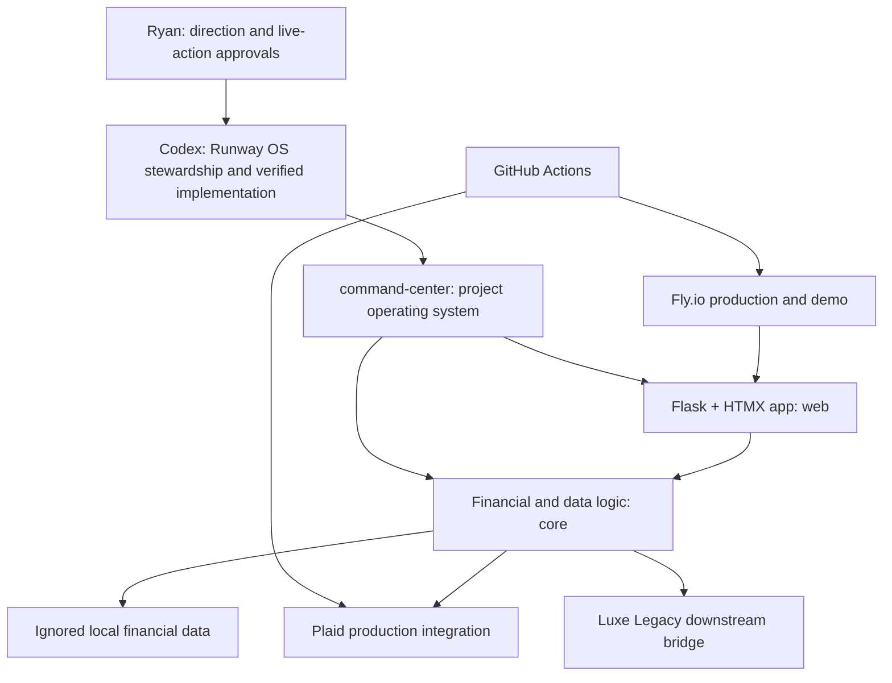

# Architecture

## Project-Control Source Of Truth

1. `command-center/roadmap.md`
2. `command-center/now.md`
3. `command-center/decisions.md`
4. `command-center/operating-rules.md`
5. `command-center/state.json`
6. Git history after work is committed

`command-center/index.html` is generated output. Existing domain documentation supports the command center but does not replace its project-control roles.

## Product Source Of Truth

- Application behavior: `web/`, `core/`, root runtime files, and tests.
- Category model: `categories.md` plus its parser in `core/categories.py`.
- Schema evolution: ordered migrations in `core/db.py`.
- Deployment automation: `.github/workflows/`, Fly configuration, and GitHub/Fly state.

## Safety Boundary

Ignored financial data and credentials remain local and closed by default. Live GitHub workflow changes, Plaid syncs, Fly deploys, production database operations, and downstream writes require a separately confirmed work block.
